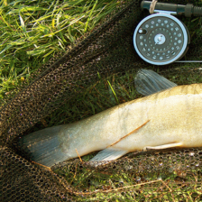
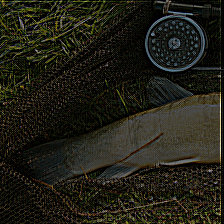
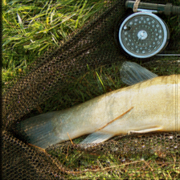

# **Poisoning Classification Networks via Imperfect Restoration**


## **Overview**
This repository contains the implementation of our paper **Leveraging imperfect restoration for data availability attack** ([paper](https://link.springer.com/chapter/10.1007/978-3-031-73464-9_5 "paper")). The proposed method leverages imperfect restoration techniques that subtly degrade the input images while introducing imperceptible poisoning patterns to mislead classification models.

The project demonstrates the attack's efficacy across multiple classification networks, datasets, and restoration methods, making it a robust framework for exploring vulnerabilities in real-world AI systems.

---

## **Generate**
To generate IRP training dataset to poison classifiers, you can simply run
```
python state_A.py
```

## **Train**
To train a classifier with IRP training dataset, you can simiply run
```
bash train.sh
```

---

## **Repository Structure**
```plaintext
├── stat_A.py                 # Script for generating IRP dataset
├── A.npy                     # CUDA kernel example file
├── augmentations.py          # Augmentation methods for preprocessing
├── data/                     # Directory containing datasets or related resources
├── experiments/              # Experiment configurations and logs
├── list/                     # Directory for data lists or related configurations
├── madrys.py                 # Script implementing Madry loss
├── main.py                   # Main script for training classification model
├── main_imagenet.py          # Script for training classification model on ImageNet
├── models/                   # Pretrained or custom model implementations
├── poison_loaders.py         # Data loader with poisoning functionality
├── README.md                 # Project documentation
├── resnet.py                 # ResNet model implementation
├── __pycache__/              # Directory for Python bytecode cache
├── train.sh                  # Shell script for training models
├── train_baseline.py         # Script for training baseline models
├── util.py                   # Utility functions for general use
├── utils.py                  # Additional utility functions
```
--
# ** Example **
   

  

  

The first column is the original images; the second column is the CUDA images; the third column is the IRP images.